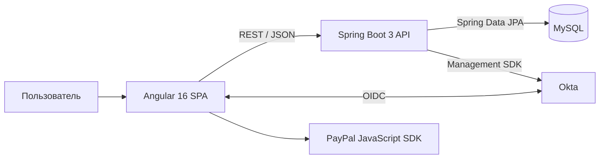

# E-Commerce Platform

Портфолио-проект интернет-магазина с SPA-клиентом и Java-бэкендом. Серверная часть предоставляет REST API для каталога и заказов, работает с доменной моделью на JPA, обрабатывает покупку в транзакции и поддерживает аутентификацию OAuth 2.0 / JWT. Клиентская часть реализует каталог, поиск, корзину, оформление заказа, историю покупок и авторизацию пользователя.

## Возможности

- Каталог товаров с категориями и подкатегориями, изображениями, цветами и остатками.
- Поиск, пагинация и сортировка каталога.
- Карточка товара, выбор варианта и добавление в корзину.
- Корзина с сохранением состояния в `sessionStorage`.
- Оформление заказа: реактивная форма Angular, клиентская валидация, адрес доставки и генерация UUID-трек-номера.
- История заказов авторизованного пользователя.
- Авторизация через Okta по OpenID Connect; Spring Security валидирует JWT access token.
- Оценка товара с хранением пользовательского состояния в профиле Okta, чтобы не отправлять повторную оценку.
- Клиентский сценарий оплаты через PayPal Buttons (заказ сохраняется после успешного `capture` на клиенте).

## Архитектура



| Слой | Реализация |
| --- | --- |
| Frontend | Angular 16, TypeScript, RxJS, Reactive Forms, Angular Router, Bootstrap |
| API | Java 17, Spring Boot 3.1, Spring Web, Spring Data REST |
| Бизнес-слой | Сервисный слой, `@Transactional`, DTO для оформления заказа |
| Данные | JPA/Hibernate, MySQL 8 |
| Безопасность | Spring Security OAuth2 Resource Server, Okta, JWT |
| Интеграции | Okta Sign-In Widget / Management SDK, PayPal JS SDK |
| Сборка и тесты | Maven Wrapper, Angular CLI, JUnit 5, Jasmine/Karma |

## Что показывает Java-бэкенд

Бэкенд расположен в [`eCommerceBackend`](eCommerceBackend) и построен как монолитное Spring Boot-приложение.

- **Доменная модель.** `Product → ProductSubcategory → ProductCategory`, варианты товара и изображения; `Customer → Order → OrderItem`, адрес заказа и выбранные цвета. Связи описаны через JPA-аннотации и каскадное сохранение.
- **Разделение ответственности.** Репозитории предоставляют Data REST и derived queries, контроллеры обслуживают нестандартные операции, сервисы содержат сценарии изменения рейтинга и оформления заказа.
- **Транзакционная покупка.** `OrderProcessingService` создаёт UUID-трек-номер, связывает заказ с покупателем, позициями, выбранными цветами и адресом, после чего сохраняет агрегат в одной транзакции.
- **Доступ к данным.** Spring Data REST публикует ресурсы каталога, географии и истории заказов; ID сущностей явно включены в ответы. Изменяющие Data REST-операции для `Product`, `Region` и `Order` отключены.
- **Безопасность.** Эндпоинты истории заказов и пользовательского состояния оценок требуют JWT. Angular-интерцептор добавляет Bearer token к защищённым запросам.

### Ключевые API-ресурсы

Базовый путь: `/eCommerceApi`.

| Метод | Ресурс | Назначение |
| --- | --- | --- |
| `GET` | `/products`, `/products/{id}` | Каталог и карточка товара; поддерживаются `page`, `size`, `sort` |
| `GET` | `/products/search/findBySubcategoryId?id={id}` | Товары подкатегории |
| `GET` | `/products/search/findBySubcategoryCategoryId?id={id}` | Товары категории |
| `GET` | `/products/search/findByNameContainingOrderBy…?name={text}` | Поиск с вариантами сортировки по дате, рейтингу и цене |
| `GET` | `/productCategories`, `/productCategories/{id}/productsubcategories` | Навигация по каталогу |
| `GET` | `/countries`, `/regions/search/findByCountryName?name={name}` | Данные для формы доставки |
| `POST` | `/checkout/purchase` | Создать заказ и получить tracking number |
| `GET` | `/orders/search/findByCustomerEmailOrderBy…?email={email}` | История заказов; JWT required |
| `POST` | `/productChange/changeRating` | Обновить агрегированный рейтинг товара |
| `POST` | `/productsRatedStates/{getStateById,addProductState}` | Прочитать/сохранить факт оценки в профиле; JWT required |

Пример запроса к каталогу:

```bash
curl "http://localhost:8080/eCommerceApi/products?page=0&size=15"
```

Успешный `POST /checkout/purchase` возвращает объект вида:

```json
{ "trackingNumber": "b03fc66b-3e50-4bfc-b4f9-1c7d1c719792" }
```

## Структура репозитория

```text
.
├── eCommerceBackend/
│   ├── src/main/java/.../
│   │   ├── config/        # Spring Security, CORS, Spring Data REST
│   │   ├── controller/    # checkout, рейтинг, пользовательские атрибуты
│   │   ├── service/       # транзакционные бизнес-сценарии
│   │   ├── dao/           # JPA repositories и derived queries
│   │   ├── entity/        # JPA-модель предметной области
│   │   └── dto/           # Purchase и ответ с трек-номером
│   └── pom.xml
└── eCommerceFrontend/
    ├── src/app/
    │   ├── services/      # HTTP-клиенты, корзина, авторизация
    │   ├── products/      # каталог и карточка товара
    │   ├── checkout/      # форма заказа и PayPal Buttons
    │   └── purchase-history/
    └── package.json
```

## Быстрый старт локально

### Требования

- JDK 17;
- Node.js 18+ и npm;
- MySQL 8 с подготовленной схемой данных;
- учётная запись/приложение Okta для сценариев авторизации;
- Google Chrome для запуска Karma-тестов.

### 1. Настроить backend

Укажите параметры MySQL и Okta в `eCommerceBackend/src/main/resources/application.properties`. Для совместной локальной работы с Angular добавьте `https://localhost:4200` в разрешённые CORS origins в `SpringAppConfig` и `MyDataRestConfig`. При использовании `environment.newenv.ts` отключите SSL в backend (`server.ssl.enabled=false`), так как локальный API указан с `http`.

Запуск в PowerShell:

```powershell
cd eCommerceBackend
.\mvnw.cmd spring-boot:run
```

API доступен по базовому пути `/eCommerceApi`.

### 2. Настроить и запустить frontend

Для локального API уже есть [`environment.newenv.ts`](eCommerceFrontend/src/environments/environment.newenv.ts) с адресом `http://localhost:8080/eCommerceApi`.

1. Проверьте настройки Okta в [`application-config.ts`](eCommerceFrontend/src/app/config/application-config.ts) и зарегистрируйте `https://localhost:4200/login/callback` как redirect URI.
2. Установите зависимости и запустите dev server:

```powershell
cd eCommerceFrontend
npm ci
npm start -- --configuration=newenv
```

Клиент по умолчанию открывается на `https://localhost:4200`.

## Проверка качества

```powershell
# Backend: Spring context smoke test
cd eCommerceBackend
.\mvnw.cmd test

# Frontend: production build
cd ..\eCommerceFrontend
npm run build

# Frontend unit tests (Chrome должен быть установлен)
npm test -- --watch=false --browsers=ChromeHeadless
```
